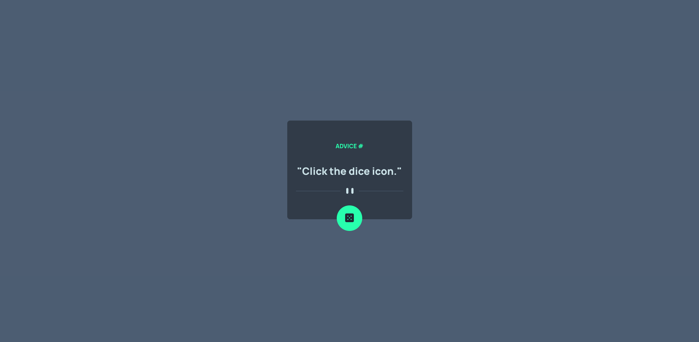

# Frontend Mentor - Advice generator app solution

This is a solution to the [Advice generator app challenge on Frontend Mentor](https://www.frontendmentor.io/challenges/advice-generator-app-QdUG-13db). Frontend Mentor challenges help you improve your coding skills by building realistic projects.

## Table of contents

- [Overview](#overview)
  - [The challenge](#the-challenge)
  - [Screenshot](#screenshot)
  - [Links](#links)
- [My process](#my-process)
  - [Built with](#built-with)
- [Author](#author)

## Overview

### The challenge

Users should be able to:

- View the optimal layout for the app depending on their device's screen size
- See hover states for all interactive elements on the page
- Generate a new piece of advice by clicking the dice icon

### Screenshot

### Links

- Solution URL: [frontendmentor.io/solutions/advice-app-built-using-react-sRaN5CnFb](https://www.frontendmentor.io/solutions/advice-app-built-using-react-sRaN5CnFb)
- Live Site URL: [advice-generator-app-dun.vercel.app](http://advice-generator-app-dun.vercel.app/)

## My process

### Built with

- [React](https://reactjs.org/) - JS library

## Author

- Website - [Samuel Adu](https://www.samueladu.com)
- Frontend Mentor - [@theadusamuel](https://www.frontendmentor.io/profile/theadusamuel)
- LinkedIn - [@theadusamuel](https://www.linkedin.com/in/theadusamuel/)
